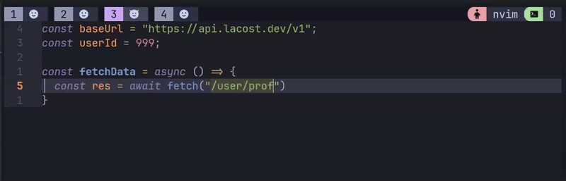

# autotemplate.nvim

> **⚠️ Early Development Warning**: This plugin is in very early development stage. It's not a final version and hasn't been properly tested or optimized for performance yet. Use with caution.

Automatic string interpolation for Neovim using Treesitter.

When you type `${` inside a string, the plugin converts `'` or `"` to backticks
and inserts the closing `}`.

## Demo



## Requirements

- Neovim 0.9+
- nvim-treesitter with parsers for your target languages

## Installation (lazy.nvim)

```lua
return {
  "jos3lo89/autotemplate.nvim",
  branch = "dev", -- or "main"
  opts = {},
}
```

## Configuration

```lua
require("autotemplate").setup({
  filetypes = {
    "javascript",
    "typescript",
    "javascriptreact",
    "typescriptreact",
    "vue",
    "svelte",
    "go",
    "python",
  },
  disable_in_macro = true,
})
```

Notes:
- `filetypes` accepts a list (as shown) or a map `{ ft = true }` for O(1) lookups.
- Only runs in Insert mode, inside a Treesitter string node.

## Commands

| Command               | Description                          |
| --------------------- | ------------------------------------ |
| `:AutoTemplateToggle` | Enable/disable the plugin globally.  |
